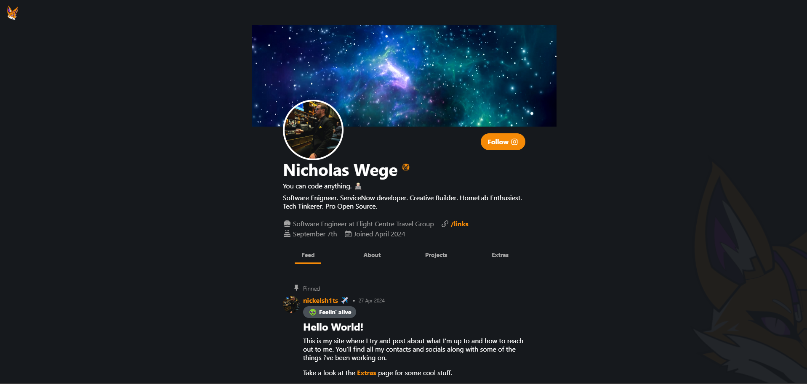

Self-hosted personal developer portfolio and project site custom built in nextjs.

## Current Features

- Interactive feed with markdown posts and permalinks.
- About section with personal story.
- Projects section with current and past project work and links.
- Extras section with interactive modal file downloads. (ie. resume, business card and contact)
- Tabbed page design with zero reload and permalinks
- Social links footer
- Me at a glance header

## Dev
- `yarn`
- `yarn build`
- `yarn dev`
OR
- `docker compose up -d`

## Production
- `docker build -t nickelsh1ts/nickelsh1ts.com:{version} .`
- `docker save -o nickelsh1ts.com.tar nickelsh1ts/nickelsh1ts.com`
- `docker load -i nickelsh1ts.com.tar`
- `docker compose up -d`

## Preview

## Contributors

<!-- ALL-CONTRIBUTORS-LIST:START - Do not remove or modify this section -->
<!-- prettier-ignore-start -->
<!-- markdownlint-disable -->
<table>
  <tbody>
    <tr>
      <td align="center" valign="top" width="14.28%"><a href="https://nickelsh1ts.com"> <b>nickelsh1ts</b></a> <a href="https://github.com/nickelsh1ts/nickelsh1ts-dev/commits?author=nickelsh1ts" title="Code">💻</a> <a href="#design-nickelsh1ts" title="Design">🎨</a> <a href="#ideas-nickelsh1ts" title="Ideas, Planning, & Feedback">🤔</a> <a href="https://github.com/nickelsh1ts/nickelsh1ts-dev/commits?author=nickelsh1ts" title="Tests">⚠️</a></td>
    </tr>
  </tbody>
</table>

<!-- markdownlint-restore -->
<!-- prettier-ignore-end -->

<!-- ALL-CONTRIBUTORS-LIST:END -->
